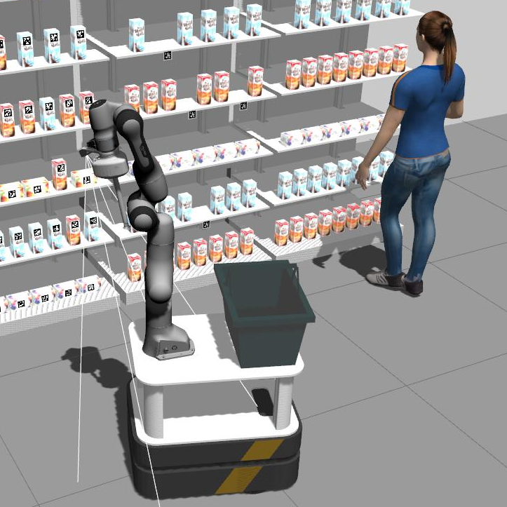

# Group 20 - Ahold Delhaize - Order picking
<p style="text-align: center;">


*Autors: Ernst Cancrinus, Kenny Brandon, Marijn de Rijk, Stan Vijverberg and Henk Jekel*

Common ROS packages for the simulation of the Airlab Albert platform.

[[_TOC_]]
</p>


## Overview

Welcome to the Supermarket Order Picking Robot project! This repository contains the software stack developed to enable a robot to navigate supermarket aisles, pick and pack customer orders, and provide assistance to shoppers. Our goal is to enhance the shopping experience by improving order accuracy, efficiency, and customer satisfaction. This is a robotics multidisciplinary project in collaboration with AholdDelhaize.




### Key Features

- Order Picking: The robot autonomously navigates supermarket aisles, identifies the items in customer orders, and picks them from shelves with precision.
- Customer Support: The robot interacts with customers, guiding them to specific product locations, answering queries, and providing recommendations based on customer preferences.
- Intuitive Interface: We've designed a user-friendly local-based interface for creating customer orders.
- Collaborative Planning: The software leverages advanced algorithms for task allocation, path planning, and collision avoidance to optimize the overall order picking process and ensure smooth robot operation.
- Integration with Supermarket Systems: Our solution integrates with existing supermarket systems, such as inventory management and point-of-sale, ensuring seamless order processing and synchronization.
- Fully implemented FlexBE behavior engine allowing complex behavior for the robot. 

### Video Demonstration

So far, successful execution of the following tasks has been demonstrated on the real Albert robot:

- Scanning for a product: The robot is able to scan and identify products.

- Picking a product from a shelf: The robot can accurately pick up products from a shelf.

- Placing a product in the basket: The robot is capable of placing the picked product in the basket.

- Presenting a product to a customer: The robot can effectively present the chosen product to a customer.

You can witness these accomplishments in the [video demonstration](https://youtu.be/8ERzKw5EQ-4)
 provided. 

## Repo structure

This repository contains (almost) all of the packages that we have developed for this project, as well as packages that have been provided by the AIRlab team.


The packages that we developed are:
- [the order package](order_package): This package contains the nodes used for managing orders.
- [the voice_requests package](voice_requests): This package contains the chatGPT-based voice assistant functionality.
- [the retail_store_skills pakcage](retail_store_skills): This package contains action servers for the skills that the robot performs.
- [the flexBE package](https://gitlab.tudelft.nl/cor/ro47007/2023/team-20/albert_flexbe): This package contains the FlexBE states and behaviors that we use for the complex behavioral control of our robot.


Information about these packages can be found in their respective READMEs (click on the links).

**Note: the FlexBE package lives in a separate repository due to build errors we encountered when trying to build it in this repository**

## Action servers & FlexBE states

Our solution makes use of the [actionlib](http://wiki.ros.org/actionlib) package to implement the actions that the robot performs.
Check out the [actionlib documentation](http://wiki.ros.org/actionlib) to learn more about the benefits of using action servers.

For controlling the complex top-level behavior of the robot, we use the [FlexBE](http://philserver.bplaced.net/fbe/index.php) behavior engine.
FlexBE is a powerful tool that allows us to create complex behaviors for the robot by combining simple states into a Finite State Machine (FSM) using a graphical user interface, the FlexBE App.

The combination of actionlib and FlexBE allows us to wrap actionlib clients into FlexBE states, which is a powerful combination.


## Installation

**IMPORTANT**: For people familiar with the simulation from the KRR course in the previous quarter, we will not be using a singularity environment this time. This is because singularity containers are write-only and for the MDP course we expect you will need the ability to install additional dependencies. Instead we will suggest you to install things locally.


Our code is made to be run on Ubuntu 20.04 with [ROS noetic](http://wiki.ros.org/noetic/Installation). Also, make sure that the [moveit](https://moveit.ros.org/install/) library is installed, as well as the catkin build tool.

First, we create a fresh catkin workspace.
```bash
#source your environment:
 source /opt/ros/noetic/setup.bash

#create and build a catkin workspace:
 mkdir -p ~/catkin_ws/src
 cd ~/catkin_ws/
 cd src
```

Now, clone the required repositories into the `src` folder of your catkin workspace.
We use vcstool to install required dependencies that should be built from source:
``` bash
# Inside your catkin workspace
git clone git@gitlab.tudelft.nl:cor/ro47007/2023/team-20/cor_mdp_ahold.git

# clone the FlexBE behavior engine and the states and behavior we made:
git clone https://github.com/team-vigir/flexbe_behavior_engine.git
git clone https://github.com/FlexBE/flexbe_app.git

# Clone our made states and behaviors into repository
git clone git@gitlab.tudelft.nl:cor/ro47007/2023/team-20/albert_flexbe.git flex_albert_behaviors

# clone franka_ros and apriltag_ros repositories
git clone https://github.com/AprilRobotics/apriltag_ros.git 
git clone https://github.com/AprilRobotics/apriltag.git 

# If not installed yet
sudo apt install python3-vcstool

#do not forget this line
vcs import --input cor_mdp_ahold/retail_store_simulation.rosinstall .
```

Next, we install all system dependencies that the packages in our workspace depend upon but are missing on your computer.

```bash
# If not installed yet
sudo apt install python3-rosdep

sudo rosdep init
rosdep update
rosdep install --from-paths . --ignore-src -y
```

Finally, we build the packages using catkin.
**Important**: Make sure that any python virtual environments are deactivated!
```bash
# If not installed yet
sudo apt install python3-catkin-tools
cd .. && catkin build
source devel/setup.bash
```

## Simulation

To start the simulation environment:

```bash
roslaunch albert_gazebo albert_gazebo_navigation.launch
```

To start the packages that are developed for this project, run these commands in separate terminals:
```bash
# order package
roslaunch order_package order_handler.launch 
# voice assistant
roslaunch voice_requests voice_requests.launch 
# action servers for skills
roslaunch retail_store_skills load_skills.launch 
```


