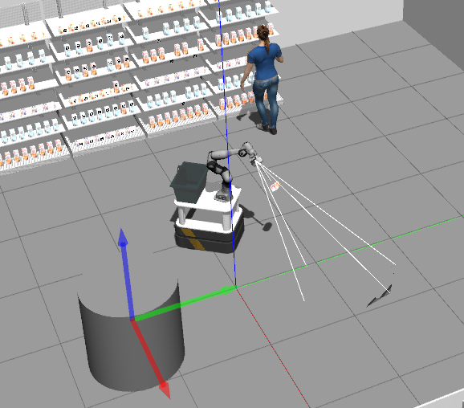

# ROS Package: Scan Processor

This ROS package provides a node called "scan_processor" that processes laser scan data and generates TF (Transform) messages for detected clusters in the environment. The node converts the laser scan data to a PointCloud2 message and applies the DBSCAN clustering algorithm from the `sklearn.cluster` module to identify clusters. The detected clusters that satisfy certain width and depth criteria are filtered and their cluster centers are calculated. Finally, the node publishes TF messages for the closest clusters.

## Dependencies

- ROS (Robot Operating System) - Melodic or newer
- `sklearn` Python package

## Usage

1. Run the `scan_processor` node:
```bash
roslaunch rosrun lidar_cluster lidar_cluster_node.py
```

2. The node subscribes to the `/front/scan` topic to receive LaserScan messages. Make sure to publish laser scan data on this topic.

3. The processed cluster information is published as TF messages on the `/tf` topic.


## Node: scan_processor

### Subscribed Topics

- `/front/scan` ([sensor_msgs/LaserScan](http://docs.ros.org/api/sensor_msgs/html/msg/LaserScan.html))
- The laser scan data used for cluster detection.

### Published Topics

- `/tf` ([tf2_msgs/TFMessage](http://docs.ros.org/api/tf2_msgs/html/msg/TFMessage.html))
- The generated TF messages representing the detected clusters.

### Parameters

- `~min_width` (float, default: 0)
- The minimum width of a valid cluster.
- `~max_width` (float, default: 1.2)
- The maximum width of a valid cluster.
- `~min_depth` (float, default: 0)
- The minimum depth of a valid cluster.
- `~max_depth` (float, default: 1.2)
- The maximum depth of a valid cluster.
- `~max_clusters` (int, default: 3)
- The maximum number of clusters to consider for TF message publishing.

### Node Details

- The `scan_processor` node initializes a ROS node with the same name.
- It creates a TF buffer, listener, and broadcaster for handling transformations.
- The node subscribes to the `/front/scan` topic and registers the `scan_callback` as the callback function.
- The `scan_callback` function converts the received LaserScan message to a PointCloud2 message and applies the DBSCAN clustering algorithm to identify clusters.
- The detected clusters are filtered based on width and depth criteria to retain customer-like clusters.
- Cluster centers are calculated for the customer-like clusters.
- The TF message for the closest clusters is generated and published on the `/tf` topic.

## Example output



In this example there are 3 clusters detetected. Cluster 1 represents a random cilinder, cluster 2 is the customer and cluster 3 is part of the wall.
## Acknowledgments

This package utilizes the following external libraries:

- `sklearn` - https://scikit-learn.org/
- `numpy` - https://numpy.org/

## Contact

For any issues or suggestions regarding this package, please contact the maintainer:

Maintainer: Henk Jekel
Email: hendrikjekel@gmail.com
