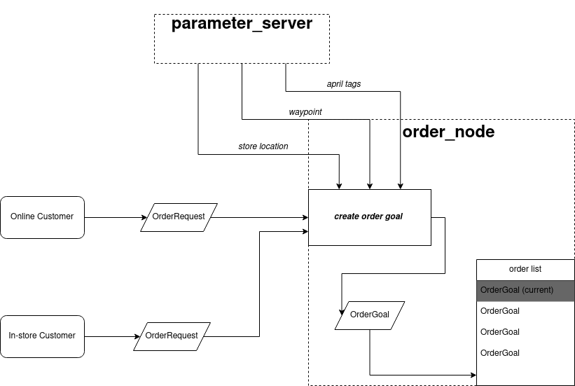
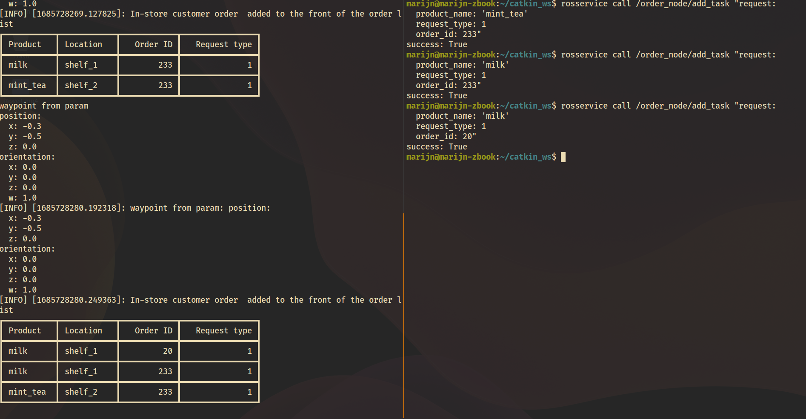

# Order Package

## Overview

The order package is designed to process product orders received from supermarket customers, connect to a database for order validation, and generate a list of items required for fulfilling the order.


### Features
- Order Processing: The package provides functionalities to receive customer orders via a popup window and initiates the order handling process.
- Database Integration: It integrates with a backend database system to retrieve necessary information, such as april tag number, product location and orientation. The order_handler node puts the database on the ROS parameter server.
- Order Feasibility Check: The package performs feasibility checks on the order, ensuring that all requested products fit within the designated packaging constraints.
- Item List Generation: Upon successful order validation, the package generates a list of items required for fulfilling the order, including their quantities. The order manager node extracts the corrosponding information from the ROS server.

### Order Node

The **`order_node`** takes care of the orders that the robot is tasked with doing.  It keeps an internal list of orders, and publishes the current order.

See a diagram of the order node below:


### Request Types

Each order has a request type.  This request type will dictate how the robot handles the order.


| Order Type | Description                                                            |
|------------|------------------------------------------------------------------------|
| 0          | Pick the product and place it in the basket (for online orders)        |
| 1          | Pick the product and give it to the customer (for in-store requests)   |
| 2          | Lead the customer to the product, but dont pick it                     |
| 3          | Return to base station (when battery is low, or an order is completed) |


### Message Types

Two custom message types have been defined in this package:
- `OrderRequest`: This message contains a product name, order id and request type.
- `OrderGoal`: This message is an extension or `OrderRequest` and contains a base waypoint and april tag ids. The `order_node` uses information from the parameter server to convert `OrderRequest` messages into `OrderGoal` messages (if possible).  


## Usage

Launch the order package with the following command:
bash
```
roslaunch order_package order_handler.launch
```

### Adding a new order

Order requests will arrive from online customers, or from in-store customers via the [voice_requests](../voice_requests) package.
To test the functionality of the order package, you can also manually add orders using the command line:
```
rosservice call /order_node/add_task
```
press tab (twice) to automatically fill in the `OrderRequest` message template.  Filling in the message and pressing enter should add the order (if the product exists in the store) to the order list.
Below is an example of adding three products to the order list:


### Marking an order as completed

The current order can be marked as completed by calling the `/order_node/mark_completed` service:
```bash
rosservice call /order_node/mark_completed
```

### Viewing the current order

The current order can be viewed on the `/order_node/current_order` topic.
```bash
rostopic echo /order_node/current_order
```


## Contact

Contributions to the order package are welcome! If you find any issues or have suggestions for improvements, please open an issue in the issue tracker. For question please mail s.c.j.vijverberg@student.tudelf.nl.

We hope you find this ROS package helpful in handling product orders effectively!
