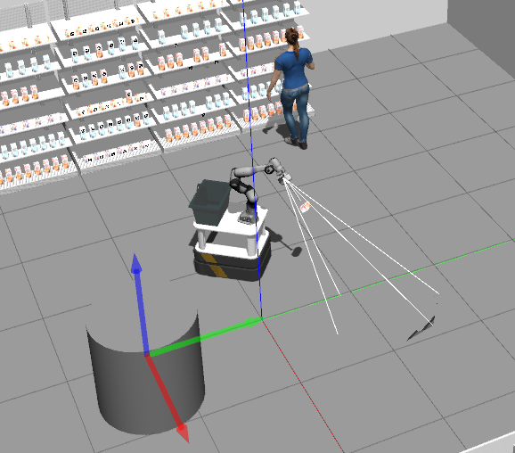
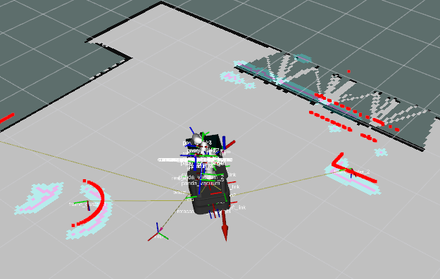
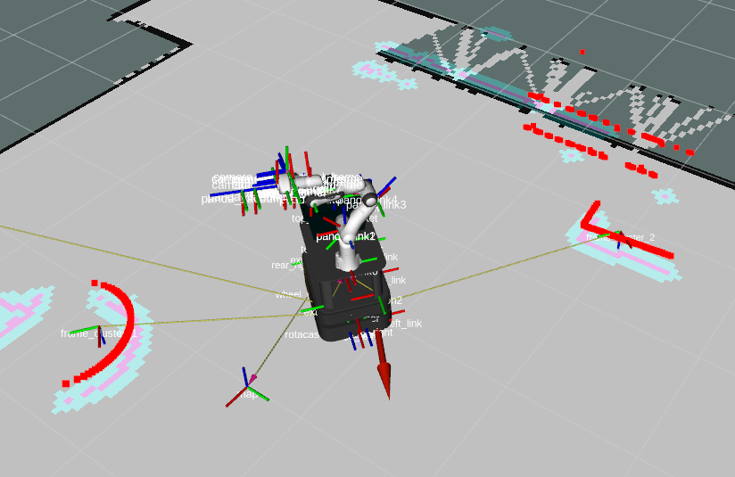
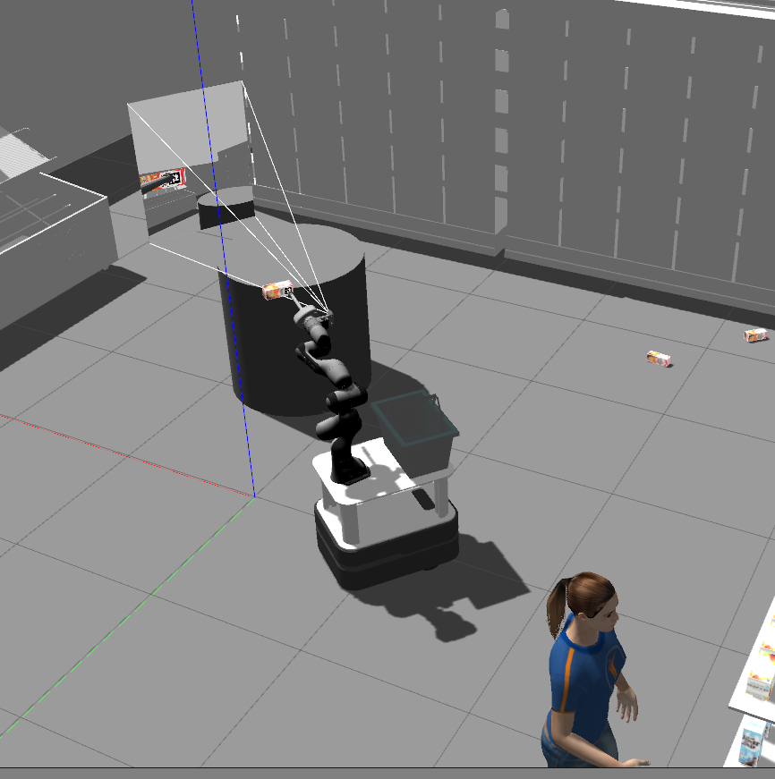
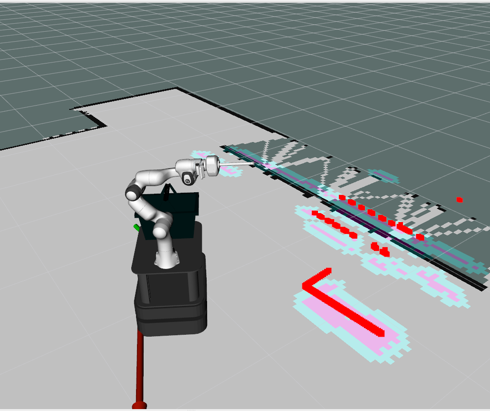
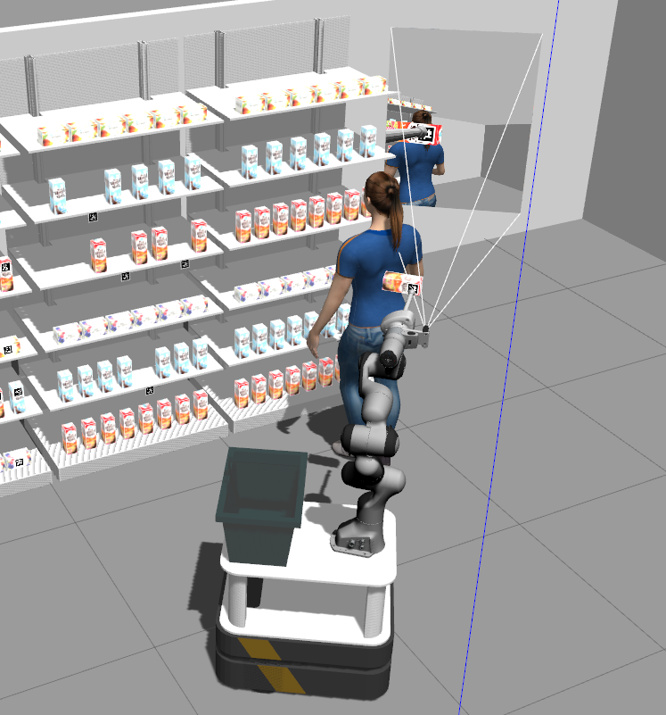

# Retail Store Skills

This repository consists of two types of action servers: provided and self-made. The provided action servers are used by Albert for tasks like picking and placing products, as well as driving. On the other hand, the self-made action servers offer additional functionality, specifically designed to present a product to a customer, place a product in the basket, and scan the shelf for a specific product. Below, you will find detailed explanations of the functionality offered by the self-made action servers. The README concludes with a practical use case that demonstrates the integration of the provided action servers and clients.


## Present Action Server

The [present_server](./scripts/present_server_moveit.py) implements an action server for the "Present" action. The purpose of this node is to control a robot arm to present an object to a customer. It relies on two additional nodes, the [`lidar_cluster`](../lidar_cluster/src/lidar_cluster_node.py) node and the [`customer_detection`](../customer_detection/src/customer_detection_node.py) node, from self-made packages.

### Functionality

When the "Present" action is called, the server performs the following steps:

1. Move the robot arm to a predefined start position.
2. Utilize the [`lidar_cluster`](../lidar_cluster/src/lidar_cluster_node.py) node to detect customer-like lidar clusters in the environment.
3. If clusters are detected:
   - Point the arm towards the closest cluster center.
   - Use the [`customer_detection`](../customer_detection/src/customer_detection_node.py) node to check if a customer is present in that cluster.
   - If a customer is detected, keep the arm pointed towards the cluster center until the part (object) is no longer present in the gripper.
4. If no customer is detected in the closest cluster, check the second closest cluster.
5. If no customer is detected in any of the clusters, serve the product at a default location to the right of the robot.
6. If no clusters are detected at all, serve the product at the default location.
7. If all steps are executed successfully, mark the action as "succeeded"; otherwise, mark it as "aborted".

### Example



In this example there are 3 clusters detetected. Cluster 1 represents a random cylinder, cluster 2 represents the customer and cluster 3 is part of the wall. The present server first checks the cylinder to see if the cylinder is the customer since it is the closest cluster center.  


The present server verifies that the cyclinder is not the customer using the customer detection node. It then checks the second closest cluster center and verifies that this cluster indeed represents the customer. 



## Place Action Server

This ROS node implements a [place action server](./scripts/place_server_moveit.py) for the "Place in basket" action. The purpose of this node is to control a robot arm to place a product in the basket mounted at the back of the robot. 

### Functionality

When the "Place in basket" action is called, the server performs the following steps:

1. Check if the product is present in the gripper. If not, the place action is aborted.
2. Add a collision box around the basket to ensure that the robot avoids collisions with it.
3. Move the robot arm to a predefined start position.
4. Plan and execute a Cartesian goal to reach the specified drop position above the basket.
5. If the planning fails, retry up to three times.
6. Initiate the dropoff action using the `franka_vacuum_gripper` package.
7. If the place action succeeds, mark the action as "succeeded"; otherwise, mark it as "aborted".
8. Remove the generated collision box.


## Scan Shelf Action Server

This ROS node implements a [scan shelf action server](./scripts/scan_shelf_server.py) for the "Scan Shelf" action. The purpose of this node is to control a robot arm to scan a shelf and locate specific April tags.

### Functionality

1. The robot arm moves to a predefined start position based on the specified shelf direction.
2. The robot arm performs a scan by looking up, looking down, and returning to the start position.
3. The node searches for April tags within the specified range of tag IDs.
4. If a tag is found, the node determines the closest tag to the robot's vacuum gripper frame.
5. The node sets the result with the ID of the closest tag and marks the action as "succeeded".
6. If no tags are found, the action is marked as "aborted".


## Example

Make sure you source your workspace for every new terminal instance.

To test a pick skill first launch the simulation:

```bash
roslaunch albert_gazebo albert_gazebo_navigation.launch
```

In another terminal window launch the skills:

```bash
roslaunch retail_store_skills load_skills.launch
```

Wait until moveit is fully initialized in the simulation.
The load_skills launch file has activated action servers for scanning the shelf, picking the product, presenting the product and placing it in the basket.

In order to pick a specific product you need to check the box "TF" in the display section in  Rviz.
If you do not see the TF box in the display section you must add it by clicking Add -> RVIZ -> TF.

Then you will see it detects the products their local axis by their april tags.
If you still do not see the tags make sure the endpoint of the robotarm is pointed towards the shelves.

Then you can see which frames from the april tags it is detecting.
By going in the display section to TF -> Frames you can see some of them are called "tag_" and with a number.

Pick a frame of the detected tags that you want to pick, for example: tag_18

In yet another terminal window, run the following to execute a pick action:
```bash
rosrun retail_store_skills [scan_shelf_client.py](./scripts/example_action_clients/scan_shelf_client.py)
```
```bash
rosrun retail_store_skills [pick_client.py](./scripts/example_action_clients/pick_client.py) 18
```
For presenting the product to a customer type in the terminal:
```bash
rosrun retail_store_skills [present_client.py](./scripts/example_action_clients/present_client.py) 
```
For placing the product in the basket type in the terminal:
```bash
rosrun retail_store_skills [place_basket_client.py](./scripts/example_action_clients/place_basket_client.py)
```


